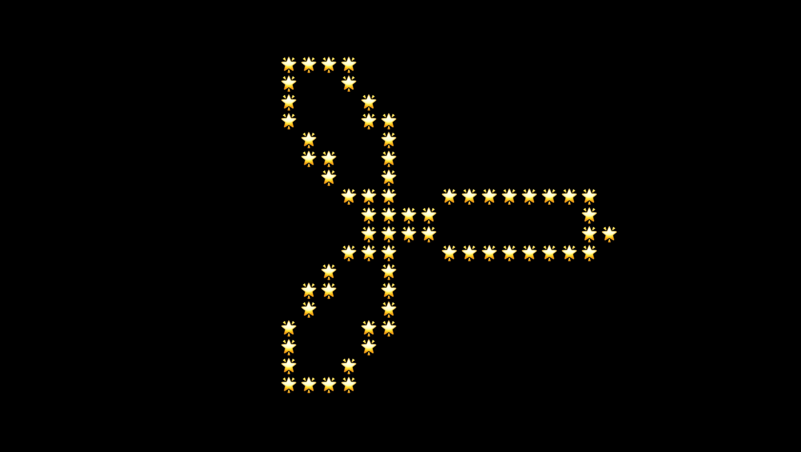

# Charming: Character Terminal Art Programming

**Charming** is a free, open-source, creative code language for character terminal art programming, which means drawing shapes in a terminal-like application with characters. It is embedded in JavaScript and uses a software rendering renderer written in Rust compiled to WASM, to gain high performance hopefully. It has a accessible, inclusive, yet expressive API inspired by [Processing](https://processing.org/) or [P5.js](https://p5js.org/). And there are [a plenty of examples](https://github.com/charming-art/charming/tree/next) to get started.

## Installing

Charming is typically installed via a package manager such as Yarn or npm.

```bash
npm install @charming-art/charming
```

```bash
yarn add @charming-art/charming
```

Charming can then imported as a namespace:

```js
import * as cm from "@charming-art/charming";
```

In vanilla HTML, Charming can be imported as an ES module, say from jsDelivr:

```html
<script type="module">
  import * as cm from "https://cdn.jsdelivr.net/npm/@charming-art/charming@0.1/+esm";

  const app = await cm.app();

  // ...

  document.body.append(app.render().node());
</script>
```

Charming is also available as a UMD bundle for legacy browsers.

```html
<script src="https://cdn.jsdelivr.net/npm/@charming-art/charming@0.1"></script>
<script>
  (async () => {
    const app = await cm.app();

    // ...

    document.body.append(app.render().node());
  })();
</script>
```

## A Simple Example

Here is a simple Charming example:

```js
const app = await cm.app({ mode: "double" });

for (let t = 0; t <= Math.PI * 2; t += Math.PI / 120) {
  const x = app.cols() / 2 + 10 * Math.cos(t) * Math.cos(t * 3);
  const y = app.rows() / 2 + 10 * Math.sin(t) * Math.cos(t * 3);
  app.stroke(cm.wide("🌟"));
  app.point(x, y);
}

document.body.append(app.render().node());
```

If Charming is properly installed, you should get a _lucky clove_ as below 🎉:



## API Reference

- [Creating Application](#creating-application)
- [Setting Attributes](#setting-attributes)
- [Drawing Shapes](#drawing-shapes)
- [Applying Transformations](#applying-transformations)
- [Control Flow](#control-flow)
- [Getting Variables](#getting-variables)

### Creating Application

<a name="app" href="#app">#</a> cm.**app**(_options_)

```js
const app = await cm.app(options);
```

- **cols**
- **rows**
- **width**
- **height**
- **fontSize**
- **fontWeight**
- **fontFamily**
- **mode**

<a name="render" href="#render">#</a> app.**render**()

```js
app.render();
```

<a name="frame" href="#frame">#</a> app.**frame**()

> WIP

```js
let x = 0;
app.frame(() => {
  app.point(x, x);
  x++;
});
```

<a name="run" href="#run">#</a> app.**run**()

> WIP

```js
app.run();
```

<a name="stop" href="#stop">#</a> app.**stop**()

> WIP

```js
app.stop();
```

### Setting Attributes

<a name="scene" href="#scene">#</a> app.**scene**(_color_)

```js
app.scene("#000000");
```

<a name="background" href="#background">#</a> app.**background**(_ch[, fg[, bg]]_)

> WIP

```js
app.background("@", "steelblue", "orange");
```

<a name="stroke" href="#stroke">#</a> app.**stroke**(_ch[, fg[, bg]]_)

```js
app.stroke("@", "steelblue", "orange");
```

<a name="nostroke" href="#nostroke">#</a> app.**noStroke**()

> WIP

```js
app.noStroke();
```

<a name="fill" href="#fill">#</a> app.**fill**(_ch[, fg[, bg]]_)

> WIP

```js
app.fill("@", "steelblue", "orange");
```

<a name="nofill" href="#nofill">#</a> app.**noFill**()

> WIP

```js
app.noFill();
```

<a name="wide" href="#wide">#</a> cm.**wide**(_ch_)

```js
cm.wide("🚀");
```

### Drawing Shapes

<a name="point" href="#point">#</a> app.**point**(_x, y_)

```js
app.point(0, 0);
```

<a name="line" href="#line">#</a> app.**line**(_x, y, x1, y1_)

> WIP

```js
app.line(0, 0, 10, 10);
```

<a name="rect" href="#rect">#</a> app.**rect**(_x, y, width, height_)

> WIP

```js
app.rect(0, 0, 10, 10);
```

<a name="pixels" href="#pixels">#</a> app.**pixels**(_x, y, render_)

```js
for (let i = 0; i < app.cols() * app.rows(); i++) {
  app.stroke(" ", "#fff", i % 2 === 0 ? "#000" : "#fff");
  app.point(i % app.cols(), (i / app.cols()) | 0);
}

app.pixels(5, 5, (context) => {
  const r = Math.max(app.cellWidth(), app.cellHeight()) / 2;
  context.fillStyle = "orange";
  context.beginPath();
  context.arc(-r, -r, r, 0, 2 * Math.PI);
  context.closePath();
  context.fill();
});
```

### Applying Transformations

<a name="translate" href="#translate">#</a> app.**translate**(_x, y_)

> WIP

```js
app.translate(10, 10);
```

<a name="scale" href="#scale">#</a> app.**scale**(_sx, sy_)

> WIP

```js
app.scale(2, 2);
```

<a name="rotate" href="#rotate">#</a> app.**rotate**(_theta_)

```js
app.rotate(Math.PI / 2);
```

### Control Flow

For advance usage, apps provide methods for custom control flow.

<a name="call" href="#call">#</a> app.**call**(_function[, arguments…]_)

Calls the specified _function_ on this app with any optional _arguments_ and returns this app. This is equivalent to calling the function by hand but avoids to break method chaining. For example, to set the color of every cells in a reusable function:

```js
function background(app, ch, fg) {
  app.stroke(ch, fg);
  for (let i = 0; i < app.cols(); i++) {
    for (let j = 0; j < app.rows(); j++) {
      app.point(i, j);
    }
  }
}
```

It breaks the method chaining between _app.scene_ and _app.render_:

```js
app.scene("#4e79a7");
background(app, "+", "#76b7b2"); // Breaks method chaining!
app.render();
```

Now say:

```js
app
  .scene("#4e79a7")
  .call(background, "+", "#76b7b2") // Facilitates the method chaining.
  .render();
```

### Getting Variables

For convince, apps provide methods to get some of internal variables.

<a name="node" href="#node">#</a> app.**node**()

Returns the canvas used to render the app. For example, to mount the rendered app to a specific DOM.

```js
const root = document.getElementById("id");
root.append(app.node());
```

<a name="cols" href="#cols">#</a> app.**cols**()

Returns the number of columns in the terminal. For example, to draw a point at the center of the terminal:

```js
app.point(app.cols() / 2, app.rows() / 2);
```

<a name="rows" href="#rows">#</a> app.**rows**()

Returns the number of rows in the terminal. For example, to draw a point at th center of the terminal:

```js
app.point(app.cols() / 2, app.rows() / 2);
```

<a name="width" href="#width">#</a> app.**width**()

Returns the computed width of the terminal, which satisfies the following constraint:

```js
app.width() === app.cols() * app.cellWidth();
```

<a name="height" href="#height">#</a> app.**height**()

Returns the computed height of the terminal, which satisfies the following constraint:

```js
app.height() === app.rows() * app.cellHeight();
```

<a name="cellWidth" href="#cellWidth">#</a> app.**cellWidth**()

Returns the computed width of the cells, which satisfies the following constraint:

```js
app.cellWidth() === app.width() / app.cols();
```

<a name="cellHeight" href="#cellHeight">#</a> app.**cellHeight**()

Returns the computed height of the cells, which satisfies the following constraint:

```js
app.cellHeight() === app.height() / app.rows();
```

<a name="fontSize" href="#fontSize">#</a> app.**fontSize**()

Returns the font size used to render text. For example, to get the default font size:

```js
const app = await cm.app();
app.fontSize(); // 15
```

<a name="fontWeight" href="#fontWeight">#</a> app.**fontWeight**()

Returns the font weight used to render text. For example, to get the default font weight:

```js
const app = await cm.app();
app.fontWeight(); // "normal"
```

<a name="fontFamily" href="#fontFamily">#</a> app.**fontFamily**()

Returns the font family used to render text. For example, to get the default font family:

```js
const app = await cm.app();
app.fontFamily(); // "courier-new, courier, monospace"
```
